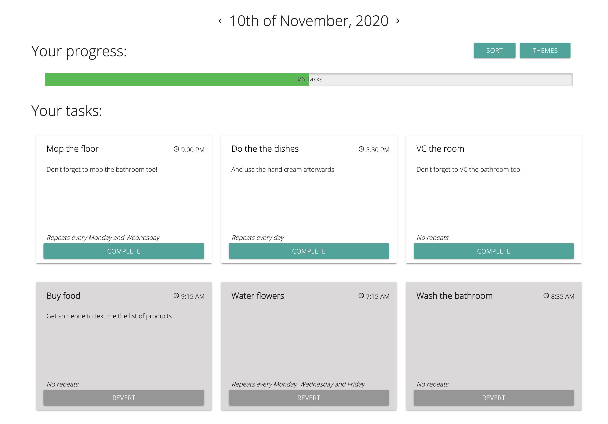
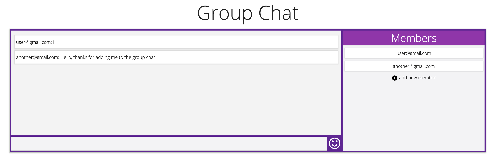
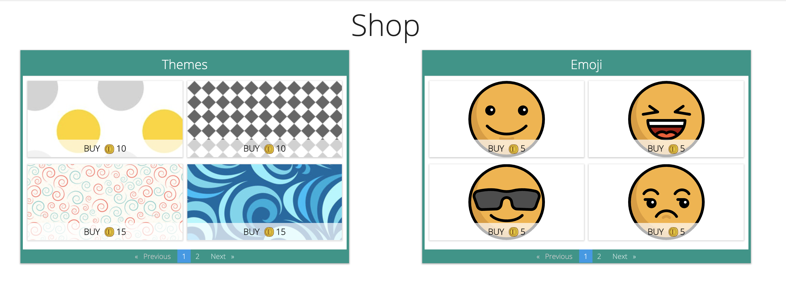

# GamePlan - a gamified todo-list app

## What and why?

This project was developed for the course "User Interface Development" at Wrocław University of Science and Technology.

We were given a task to create an app prototype (UI only) and test that UI with different people and use-cases.

We started with selecting a "to-do list" app as our theme. We then conducted market research, asking people about their lives and taking note on what they thought about their tasks, what words they were using and whether they could benefit from a planner app such as ours. We later developed a paper UI prototype and turned it into reality with AngularJS. 

This repository contains our final interactive UI prototype.

## The Team

Paulina Binas

Tenzin Choewang

Oleksii Kyrylchuk

## Screenshots

 
Today page - Your task dashboard

 
Chat page - socializing with fellow productivity hackers might help boost motivation!

 
Shop page - how can we monetize a to-do list? By adding themes and emojis!

## Technical stuff (Angular)

This project was generated with [Angular CLI](https://github.com/angular/angular-cli) version 1.5.4.

### Development server

Run `ng serve` for a dev server. Navigate to `http://localhost:4200/`. The app will automatically reload if you change any of the source files.

### Code scaffolding

Run `ng generate component component-name` to generate a new component. You can also use `ng generate directive|pipe|service|class|guard|interface|enum|module`.

### Build

Run `ng build` to build the project. The build artifacts will be stored in the `dist/` directory. Use the `-prod` flag for a production build.

### Running unit tests

Run `ng test` to execute the unit tests via [Karma](https://karma-runner.github.io).

### Running end-to-end tests

Run `ng e2e` to execute the end-to-end tests via [Protractor](http://www.protractortest.org/).

### Further help

To get more help on the Angular CLI use `ng help` or go check out the [Angular CLI README](https://github.com/angular/angular-cli/blob/master/README.md).
